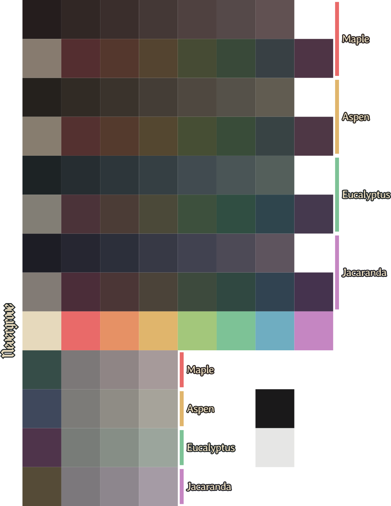
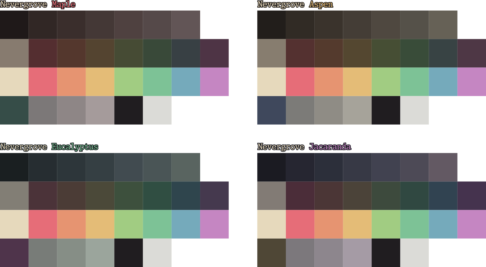

# Nevergrove
#### An everforest-inspired dark palette featuring deep, rich colors with the right amount of contrast.
###### _See how it looks in the [demo page](https://icarojam.github.io/nevergrove/)!!_

Nevergrove comes in four distinct variants, each centered around a color:
- Maple: Red
- Aspen: Yellow
- Eucalyptus: Teal
- Jacaranda: Purple

Choose the one you like the most :)

## Themes
### Firefox
Nevergrove themes are available in the Mozilla Addon Store!

[Maple](https://addons.mozilla.org/en-GB/firefox/addon/nevergrove-maple/)

[Aspen](https://addons.mozilla.org/en-GB/firefox/addon/nevergrove-aspen/)

[Eucalyptus](https://addons.mozilla.org/en-GB/firefox/addon/nevergrove-eucalyptus/)

[Jacaranda](https://addons.mozilla.org/en-GB/firefox/addon/nevergrove-jacaranda/)

### Planned
I intend to make color themes of all four variants for the various tools I use.  
Themes being currently developed:
- Vivaldi

Stuff planned for the future:
- Vim/Neovim
- VSCode
- Obsidian
- Breeze (Plasma 6) cursors
- GTK

### Motivation
I really like the everforest palette, but I always thought it was a bit lackluster in terms of contrast, some colors looking a bit too similar, everything being a bit too pale.
Some (maybe most) people might think it is fine as it is, but I personally disagree, so I went and made my own.

## Developing
The project is structured so that any color changes made in inkscape can be automatically matched in the rest of the files by simply running the `updateVars.sh` script.
To achieve this, the palette color's are implemented using inkscape swatches, which are then parsed to find each color. These colors are then replaced in all other relevant files to update the themes for all subprojects.
