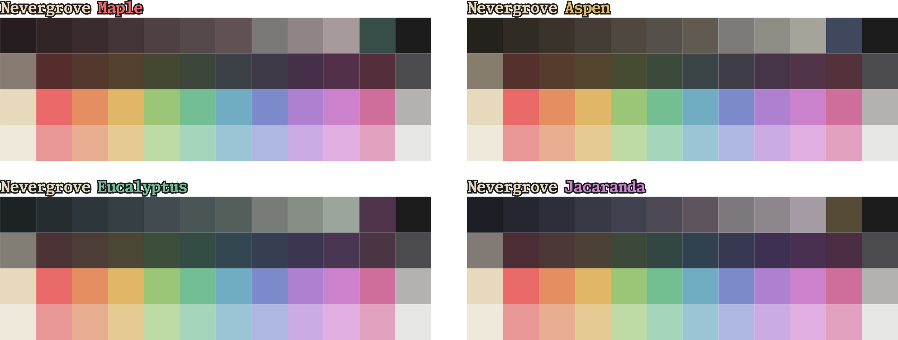
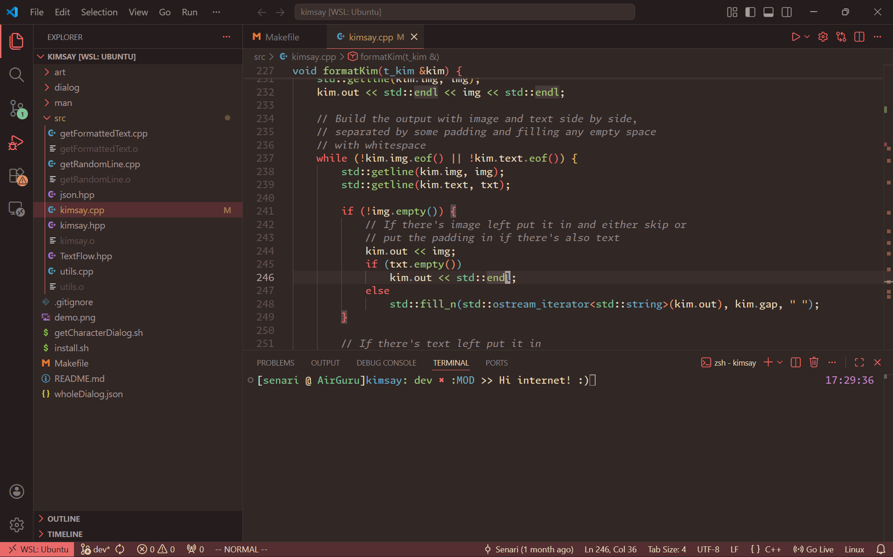
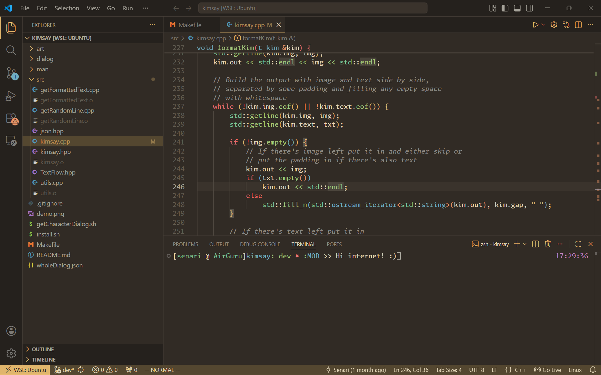
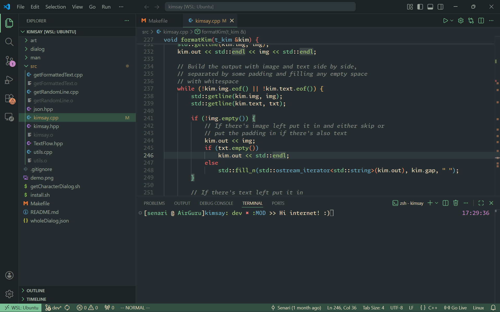
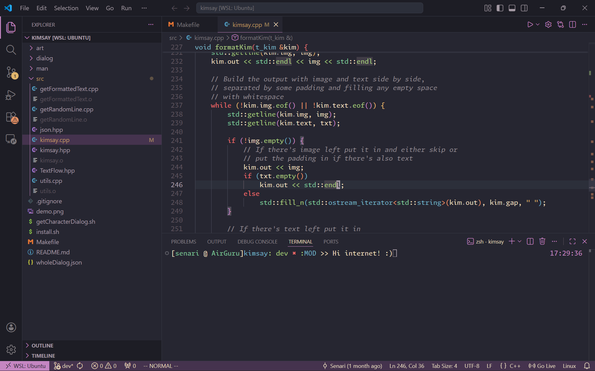
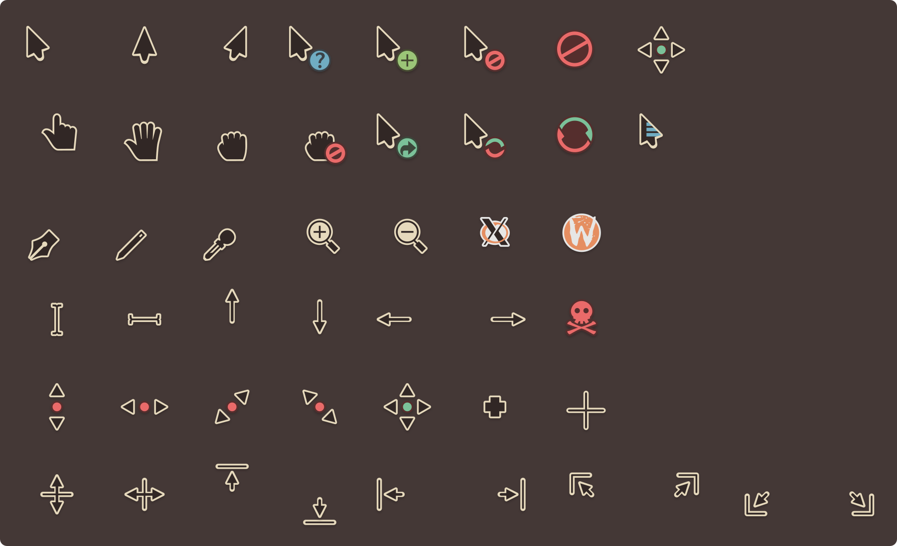
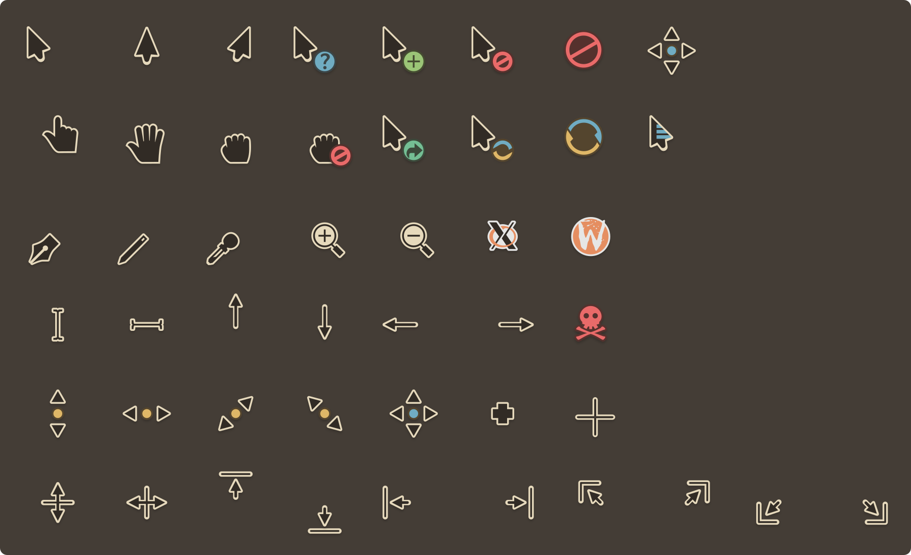
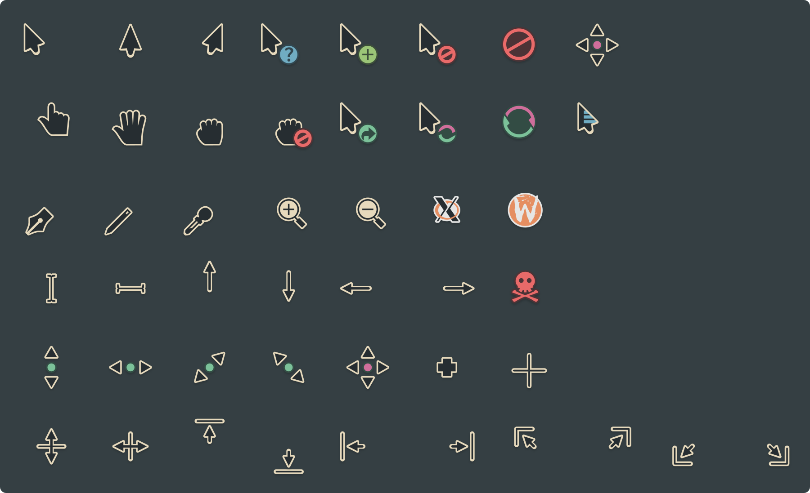
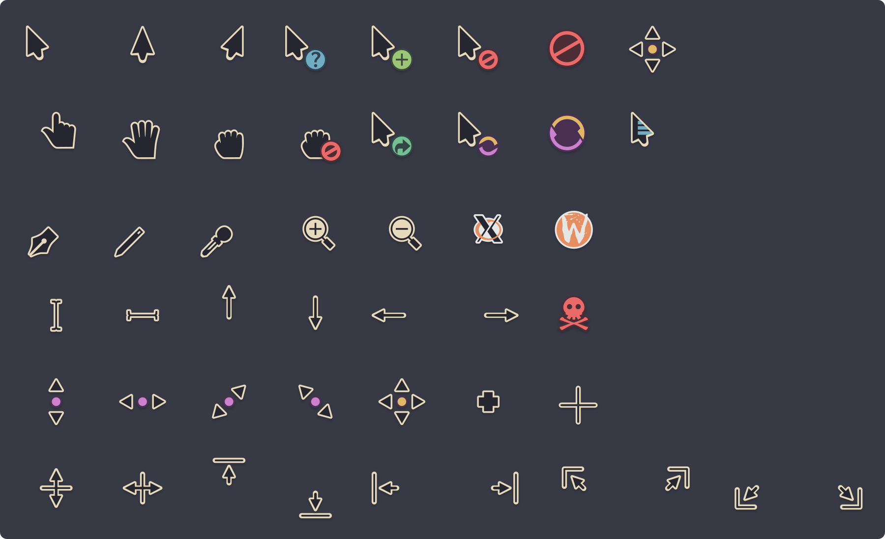
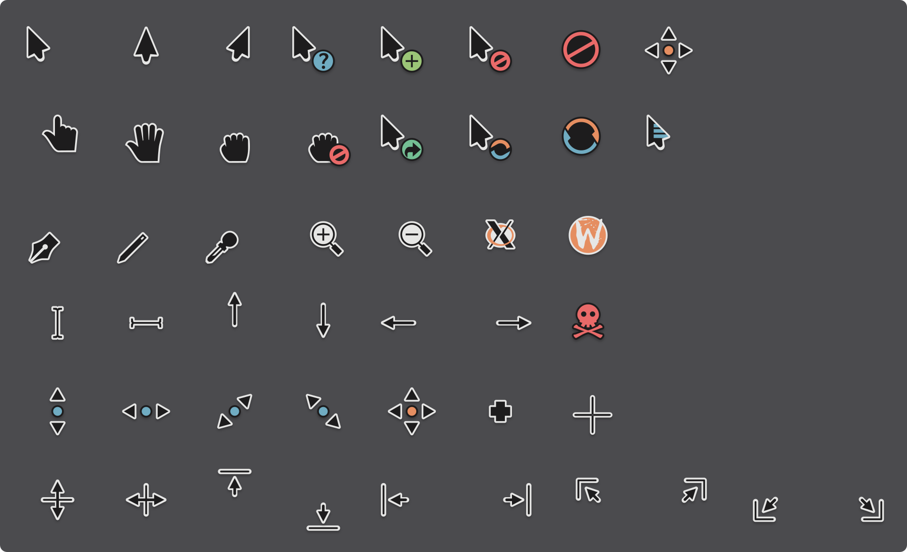

<h3 align="center">
	
	<br>
	Nevergrove
</h3>
<h4 align="center">
	An <a href="https://github.com/sainnhe/everforest">everforest</a>-inspired dark palette featuring deep, rich colors with the right amount of contrast.
</h4>

---

###### _See how it looks on the [site](https://icarojam.github.io/nevergrove/)!!_



Nevergrove comes in four distinct variants, each centered around a color:
- Maple: Red
- Aspen: Yellow
- Eucalyptus: Teal
- Jacaranda: Pink

Choose the one you like the most :)

## Themes
Nevergrove themes are available for a bunch of stuff!
- [Firefox](#firefox)
- [Vivaldi](#vivaldi)
- [Alacritty](#alacritty)
- [Foot](#foot)
- [VSCode](#vscode)
- [Breeze (Plasma 6) cursors](#breeze-6-cursors)

I'm also working on bringing them to other tools. Currently being developed:
- Obsidian

Planned for the future:
- Vim/Neovim
- GTK

### Firefox
[Maple](https://addons.mozilla.org/en-GB/firefox/addon/nevergrove-maple/)


[Aspen](https://addons.mozilla.org/en-GB/firefox/addon/nevergrove-aspen/)


[Eucalyptus](https://addons.mozilla.org/en-GB/firefox/addon/nevergrove-eucalyptus/)


[Jacaranda](https://addons.mozilla.org/en-GB/firefox/addon/nevergrove-jacaranda/)


### Vivaldi
- [Maple](https://themes.vivaldi.net/themes/VmjvVAZQlYg)
- [Aspen](https://themes.vivaldi.net/themes/zrnvLBGO7L4)
- [Eucalyptus](https://themes.vivaldi.net/themes/jXW70yDWldk)
- [Jacaranda](https://themes.vivaldi.net/themes/PKbv86Qz7r3)

### Alacritty
These you have to build yourself for now. Clone the repo and run the `updateVars.sh` script. The theme resulting theme files are located in `build/alacritty/`.

To use one of them add `import = ["<path-to-theme>"]` to your alacritty config file.

### Foot
These you have to build yourself for now. Clone the repo and run the `updateVars.sh` script. The theme resulting theme files are located in `build/foot/`.

To use one of them add
```
[main]
include=<path-to-file>
```
to your foot config file.

### VSCode
For installation steps and further info visit [the repo!](https://github.com/IcaroJam/nevergrove-vscode)

Maple


Aspen


Eucalyptus


Jacaranda


### Breeze 6 Cursors
For installation steps and further info visit [the repo!](https://github.com/IcaroJam/breeze6-cursors-nevergrove)

Maple


Aspen


Eucalyptus


Jacaranda


Neutral


## Developing
The project is structured so that any color changes made in inkscape can be automatically matched in the rest of the files by simply running the `updateVars.sh` script.
To achieve this, the palette color's are implemented using inkscape swatches, which are then parsed to find each color. These colors are then replaced in all other relevant files to update the themes for all subprojects.

## Thanks
This palette was initially inspired by [everforest](https://github.com/sainnhe/everforest), which was the base for both the name and the eucalyptus variant.

I later drew inspiration from [catppuccin](https://github.com/catppuccin/catppuccin/) to create the 48-color extended version that comprises nevergrove today.

The nevergrove site is heavily inspired by that of [nord](https://www.nordtheme.com/).

All three are great palettes, if you somehow don't know them go check them out!
